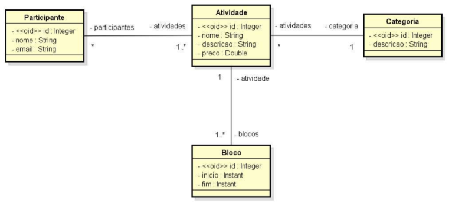
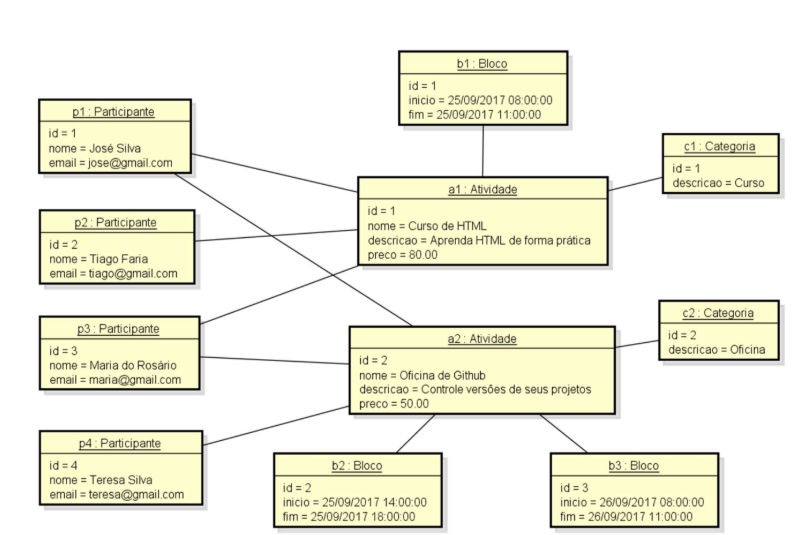

# 🎓 Sistema de Gestão de Atividades e Participantes

Este é um sistema de exemplo construído com Spring Boot e JPA (Hibernate) que simula a organização de eventos educacionais. Ele permite cadastrar participantes, atividades (como cursos e oficinas), categorias, blocos de horário e vincular os relacionamentos entre essas entidades.

---

## 🗂️ Entidades do Projeto

O projeto foi modelado com base nos diagramas abaixo:

  
*Diagrama Conceitual do Sistema*

  
*Exemplo de Instâncias com Dados*

---

## 📌 Funcionalidades

- Cadastro de Participantes com nome e e-mail.
- Cadastro de Atividades, contendo nome, descrição, preço e categoria.
- Cadastro de Blocos com horários de início e fim vinculados às atividades.
- Cadastro de Categorias (Ex: Curso, Oficina).
- Relacionamento muitos para muitos entre Participantes e Atividades.
- Relacionamento um para muitos entre Atividade e Bloco.
- Relacionamento muitos para um entre Atividade e Categoria.

---

## 🛠️ Tecnologias Utilizadas

- Java 17+
- Spring Boot
- Spring Data JPA (Hibernate)
- H2 Database (memória)
- Maven

---

## 🧪 Como Rodar

```bash
# Clone o repositório
git clone https://github.com/seu-usuario/seu-repositorio.git

# Entre no diretório do projeto
cd seu-repositorio

# Rode a aplicação
./mvnw spring-boot:run
```
## 💻 Acesse o Console H2

Após iniciar o projeto, acesse o console H2 pelo navegador:

🔗 [http://localhost:8080/h2-console](http://localhost:8080/h2-console)

**Configurações:**

- **JDBC URL**: `jdbc:h2:mem:testdb`
- **Usuário**: `sa`
- **Senha**: *(em branco)*

---

## 🧾 Exemplo de Inserts SQL

```sql
-- Participantes
INSERT INTO tb_participante(id, nome, email) VALUES (1, 'José Silva', 'jose@gmail.com');
INSERT INTO tb_participante(id, nome, email) VALUES (2, 'Tiago Faria', 'tiago@gmail.com');

-- Categorias
INSERT INTO tb_categoria(id, descricao) VALUES (1, 'Curso');
INSERT INTO tb_categoria(id, descricao) VALUES (2, 'Oficina');

-- Atividades
INSERT INTO tb_atividade(id, nome, descricao, preco, categoria_id)
VALUES (1, 'Curso de HTML', 'Aprenda HTML de forma prática', 80.00, 1);
INSERT INTO tb_atividade(id, nome, descricao, preco, categoria_id)
VALUES (2, 'Oficina de Github', 'Controle versões de seus projetos', 50.00, 2);

-- Blocos
INSERT INTO tb_bloco(id, inicio, fim, atividade_id)
VALUES (1, '2017-09-25T08:00:00', '2017-09-25T11:00:00', 1);
INSERT INTO tb_bloco(id, inicio, fim, atividade_id)
VALUES (2, '2017-09-25T14:00:00', '2017-09-25T18:00:00', 2);

-- Participações
INSERT INTO tb_participante_atividade(participante_id, atividade_id) VALUES (1, 1);
INSERT INTO tb_participante_atividade(participante_id, atividade_id) VALUES (1, 2);
INSERT INTO tb_participante_atividade(participante_id, atividade_id) VALUES (2, 1);
```

## 📚 Possíveis Extensões Futuras

- Interface Web com Thymeleaf ou React  
- Integração com banco de dados MySQL  
- Validações com Bean Validation  
- API REST para consumo externo  
- Exportação de listas de participantes por atividade

---

## 👨‍💻 Autor

**Willian Ataides**  
📧 [willian.ataides@hotmail.com](mailto:willian.ataides@hotmail.com)  
📍 Niterói - RJ

